# 🏢 Multi-Vendor Procurement & Purchase Order Management System

> A full-stack, role-based enterprise procurement platform built with Python Flask, SQLite, Firebase Authentication, and deployed live on Vercel.

[](https://procurement-system-peach.vercel.app)
[](https://python.org)
[](https://flask.palletsprojects.com)
[](https://firebase.google.com)
[](https://sqlite.org)

---

## 📋 Table of Contents

- [Project Overview](#-project-overview)
- [Key Features](#-key-features)
- [Technology Stack](#-technology-stack)
- [System Architecture](#-system-architecture)
- [Database Schema (ER Design)](#-database-schema-er-design)
- [User Roles & Workflow](#-user-roles--workflow)
- [KPI Dashboards](#-kpi-dashboards)
- [Screenshots](#-screenshots)
- [Installation & Setup](#-installation--setup)
- [Deployment on Vercel](#-deployment-on-vercel)
- [Project Structure](#-project-structure)
- [Test Accounts](#-test-accounts)
- [Security Features](#-security-features)
- [Author](#-author)

---

## 🎯 Project Overview

This project simulates a **real-world enterprise procurement workflow** — the complete lifecycle of how an organization purchases goods from external vendors. It covers every step from an employee requesting an item, through managerial approval, vendor selection, purchase order generation, shipment tracking, invoice processing, and financial payment.

The system is designed for **users of all technical backgrounds** — each role sees only what they need, with clear KPI metrics displayed as large, color-coded number cards at the top of every dashboard for instant situational awareness.

### Business Problem Solved

In large organizations, procurement is a multi-step, multi-department process involving:
- **Employees** who need to request items
- **Managers** who approve or reject requests based on budgets
- **Procurement Officers** who find vendors and issue Purchase Orders
- **Vendors** who fulfill and ship orders
- **Finance Teams** who process invoices and release payments
- **Administrators** who oversee the entire operation

This system digitizes and streamlines this entire pipeline with role-based access control, real-time budget tracking, audit logging, and data visualization.

---

## ✨ Key Features

| Feature | Description |
|---------|-------------|
| 🔐 **Firebase Authentication** | Secure email/password login via Google Firebase Auth SDK |
| 👥 **6 User Roles** | Employee, Manager, Procurement, Vendor, Finance, Super Admin |
| 📊 **KPI Dashboard Cards** | Real-time metrics displayed as large, easy-to-read number cards for every role |
| 📈 **Chart.js Visualizations** | Interactive doughnut and pie charts for budget analysis and order pipeline |
| 💰 **Budget Tracking** | Real-time department budget allocation, usage, and remaining balance |
| 📝 **Full Audit Trail** | Every action logged with timestamp (Central Time), user, IP address |
| 🗑️ **Admin Log Management** | Super Admin can clear logs individually or wipe all at once |
| 🎨 **Premium Dark UI** | Glassmorphism cards, gradient backgrounds, animated blobs, hover effects |
| ☁️ **Vercel Deployment** | Live serverless deployment with automatic GitHub CI/CD |
| 📱 **Responsive Design** | Works on desktop, tablet, and mobile screens |

---

## 🛠 Technology Stack

### Backend
| Technology | Purpose |
|-----------|---------|
| **Python 3.12** | Core programming language |
| **Flask 3.0.2** | Lightweight web framework for routing, templates, and request handling |
| **Flask-Login 0.6.3** | Session management and user authentication state |
| **SQLite 3** | Embedded relational database — zero configuration, file-based |
| **pytz** | Timezone handling — all audit logs recorded in US/Central time |

### Frontend
| Technology | Purpose |
|-----------|---------|
| **HTML5 / Jinja2** | Page structure and server-side template rendering |
| **CSS3 (Custom)** | Dark theme, glassmorphism, gradients, blob animations |
| **Bootstrap 5.3** | Responsive grid system, tables, badges, progress bars |
| **JavaScript (ES6+)** | Client-side Firebase auth, dynamic chart rendering |
| **Chart.js 4.x** | Interactive doughnut and pie chart visualizations |
| **Google Fonts (Inter)** | Modern, clean typography |

### Authentication
| Technology | Purpose |
|-----------|---------|
| **Firebase Auth SDK** | Client-side email/password authentication |
| **Firebase Console** | User management, API key restrictions by domain |

### Deployment & DevOps
| Technology | Purpose |
|-----------|---------|
| **Vercel** | Serverless Python hosting with automatic GitHub deploys |
| **GitHub** | Version control and CI/CD trigger |
| **Git** | Source code management |

---

## 🏗 System Architecture

```
┌─────────────────────────────────────────────────────────┐
│                      USER BROWSER                       │
│                                                         │
│  ┌──────────────┐    ┌──────────────┐    ┌───────────┐  │
│  │ Login Page   │───▶│ Firebase Auth│───▶│ Dashboard │  │
│  │ (HTML/JS)    │    │ (Client SDK) │    │ (Jinja2)  │  │
│  └──────────────┘    └──────┬───────┘    └─────┬─────┘  │
└─────────────────────────────┼──────────────────┼────────┘
                              │                  │
                    ┌─────────▼──────────────────▼────────┐
                    │         FLASK BACKEND (app.py)       │
                    │                                      │
                    │  /api/auth ◄── Firebase email verify │
                    │  /dashboard ◄── Role-based routing   │
                    │  /submit_pr ◄── Create requests      │
                    │  /approve_pr ◄── Manager decisions   │
                    │  /generate_po ◄── Issue orders       │
                    │  /vendor_ship ◄── Mark shipped       │
                    │  /finance_invoice ◄── Process pays   │
                    │  /clear_log ◄── Admin log control    │
                    │  /clear_all_logs ◄── Bulk wipe       │
                    └─────────────────┬────────────────────┘
                                      │
                    ┌─────────────────▼────────────────────┐
                    │        SQLite DATABASE                │
                    │        (procurement.db)               │
                    │                                      │
                    │  Tables: Users, Roles, Departments,  │
                    │  Vendors, Purchase_Requests,         │
                    │  PR_Approvals, PR_Status_History,     │
                    │  Purchase_Orders, Goods_Receipt,     │
                    │  Invoices, Payments, Audit_Log       │
                    └──────────────────────────────────────┘
```

---

## 🗄 Database Schema & Visual Diagrams

The database follows a **normalized relational design** with **16 interconnected tables** across 6 functional groups. Below are professional diagrams showing every aspect of the database backbone.

---

### 📐 Diagram 1: Complete Entity-Relationship (ER) Diagram

This shows **all 16 tables**, their columns, data types, primary keys (PK), and foreign key relationships:

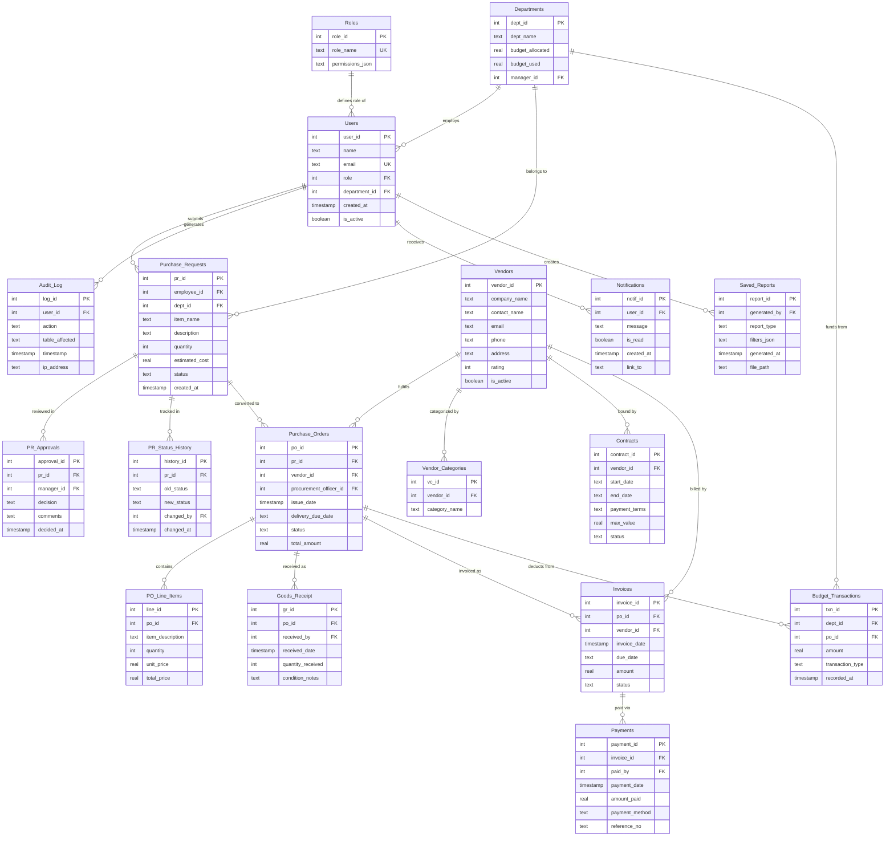

---

### 📐 Diagram 2: Table Classification by Functional Group

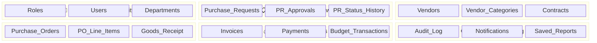

---

### 📐 Diagram 3: Procurement Workflow State Machine

This shows how a Purchase Request transitions through **every possible status** across the entire system:

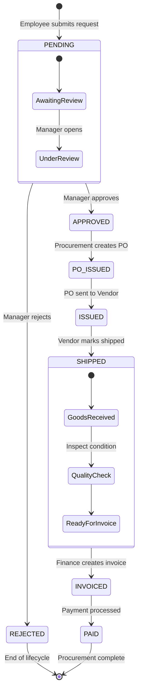

---

### 📐 Diagram 4: Data Flow Diagram (DFD Level 1)

Shows how data flows between each user role, the Flask application, and the database:

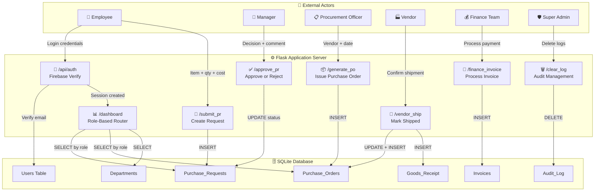

---

### 📐 Diagram 5: Authentication & Login Sequence

Step-by-step sequence of how a user logs into the system:

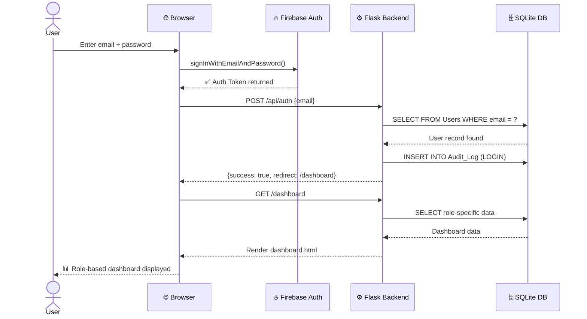

---

### 📐 Diagram 6: Complete Procurement Lifecycle Sequence

Shows the full end-to-end journey of one purchase from request to payment:

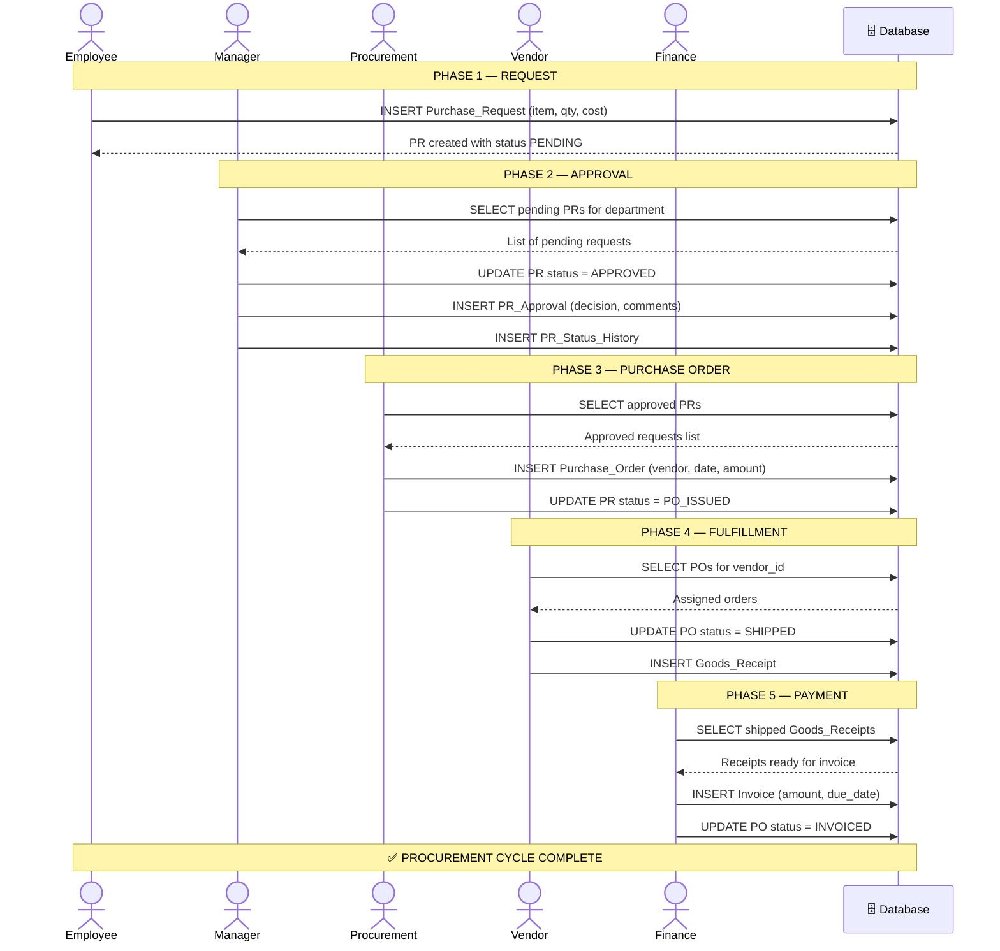

---

### 📐 Diagram 7: Database Normalization Analysis

The schema satisfies **Third Normal Form (3NF)** — here's the breakdown:

| Normal Form | Requirement | How Our Schema Satisfies It |
|-------------|-------------|-----------------------------|
| **1NF** | All columns atomic, no repeating groups | ✅ Every column stores a single value. No arrays or nested data. |
| **2NF** | No partial dependencies on composite keys | ✅ All tables use single-column `AUTOINCREMENT` primary keys, eliminating partial dependencies entirely. |
| **3NF** | No transitive dependencies | ✅ Non-key attributes depend only on the PK. Example: `Users.role` → `Roles` table (not stored redundantly). Budget data lives in `Departments`, not duplicated in `Users`. |

**Key Normalization Decisions:**
- **Roles** separated from **Users** → avoids storing role names repeatedly
- **Departments** separated from **Users** → budget data stored once, not per-user
- **PR_Approvals** separated from **Purchase_Requests** → one PR can have multiple review records
- **PR_Status_History** tracks every state change independently → full audit trail
- **Vendor_Categories** separated from **Vendors** → one vendor can serve multiple categories (1:N)
- **PO_Line_Items** separated from **Purchase_Orders** → one PO can contain multiple items
- **Budget_Transactions** separated from **Departments** → transaction log vs. running total

### Foreign Key Dependency Map

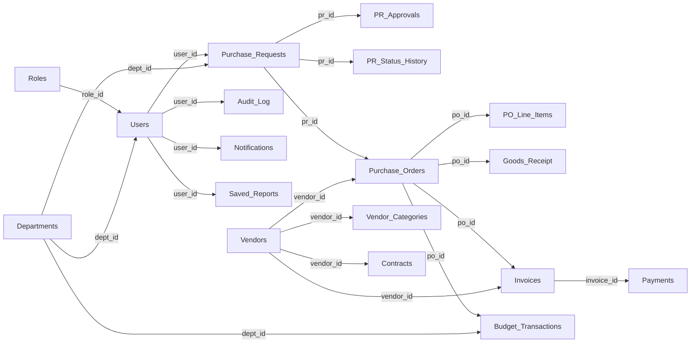

---

### 📐 Diagram 8: Use Case Diagram

Shows which actions each user role can perform in the system:

```mermaid
flowchart TB
    subgraph System["🏢 Procurement Management System"]
        UC1["📝 Submit Purchase Request"]
        UC2["📊 View Request History"]
        UC3["✅ Approve/Reject Request"]
        UC4["💰 View Department Budget"]
        UC5["📦 Generate Purchase Order"]
        UC6["🏭 Select Vendor"]
        UC7["🚚 Mark Order Shipped"]
        UC8["🧾 Process Invoice"]
        UC9["📈 View Accounts Payable"]
        UC10["📊 View Budget Charts"]
        UC11["📋 View Audit Logs"]
        UC12["🗑️ Clear Audit Logs"]
        UC13["📊 View PO Pipeline Chart"]
        UC14["📊 View KPI Metrics"]
    end

    EMP["👤 Employee"] --> UC1
    EMP --> UC2
    EMP --> UC14

    MGR["👔 Manager"] --> UC3
    MGR --> UC4
    MGR --> UC14

    PROC["📋 Procurement"] --> UC5
    PROC --> UC6
    PROC --> UC14

    VEND["🏭 Vendor"] --> UC7
    VEND --> UC14

    FIN["💰 Finance"] --> UC8
    FIN --> UC9
    FIN --> UC14

    ADMIN["🛡️ Super Admin"] --> UC10
    ADMIN --> UC11
    ADMIN --> UC12
    ADMIN --> UC13
    ADMIN --> UC14
```

---

### All 16 Tables Summary

| # | Table | Group | PK | Foreign Keys | Purpose |
|---|-------|-------|----|-------------|---------|
| 1 | **Roles** | Auth | `role_id` | — | System role definitions |
| 2 | **Users** | Auth | `user_id` | `role`, `department_id` | User accounts |
| 3 | **Departments** | Auth | `dept_id` | `manager_id` | Budget tracking per department |
| 4 | **Audit_Log** | System | `log_id` | `user_id` | Action logging with IP & timestamp |
| 5 | **Purchase_Requests** | Workflow | `pr_id` | `employee_id`, `dept_id` | Item requests from employees |
| 6 | **PR_Approvals** | Workflow | `approval_id` | `pr_id`, `manager_id` | Manager review decisions |
| 7 | **PR_Status_History** | Workflow | `history_id` | `pr_id`, `changed_by` | Status change audit trail |
| 8 | **Vendors** | Vendor | `vendor_id` | — | Supplier companies |
| 9 | **Vendor_Categories** | Vendor | `vc_id` | `vendor_id` | Vendor specializations |
| 10 | **Contracts** | Vendor | `contract_id` | `vendor_id` | Vendor agreements |
| 11 | **Purchase_Orders** | Orders | `po_id` | `pr_id`, `vendor_id`, `officer_id` | Official purchase documents |
| 12 | **PO_Line_Items** | Orders | `line_id` | `po_id` | Individual items within a PO |
| 13 | **Goods_Receipt** | Orders | `gr_id` | `po_id`, `received_by` | Delivery confirmation records |
| 14 | **Invoices** | Finance | `invoice_id` | `po_id`, `vendor_id` | Billing documents |
| 15 | **Payments** | Finance | `payment_id` | `invoice_id`, `paid_by` | Payment transactions |
| 16 | **Budget_Transactions** | Finance | `txn_id` | `dept_id`, `po_id` | Department budget movements |
| — | **Notifications** | System | `notif_id` | `user_id` | User notifications |
| — | **Saved_Reports** | System | `report_id` | `generated_by` | Exported report records |

---

### 📐 Crow's Foot ERD — Module 1: User Identity & Access Control

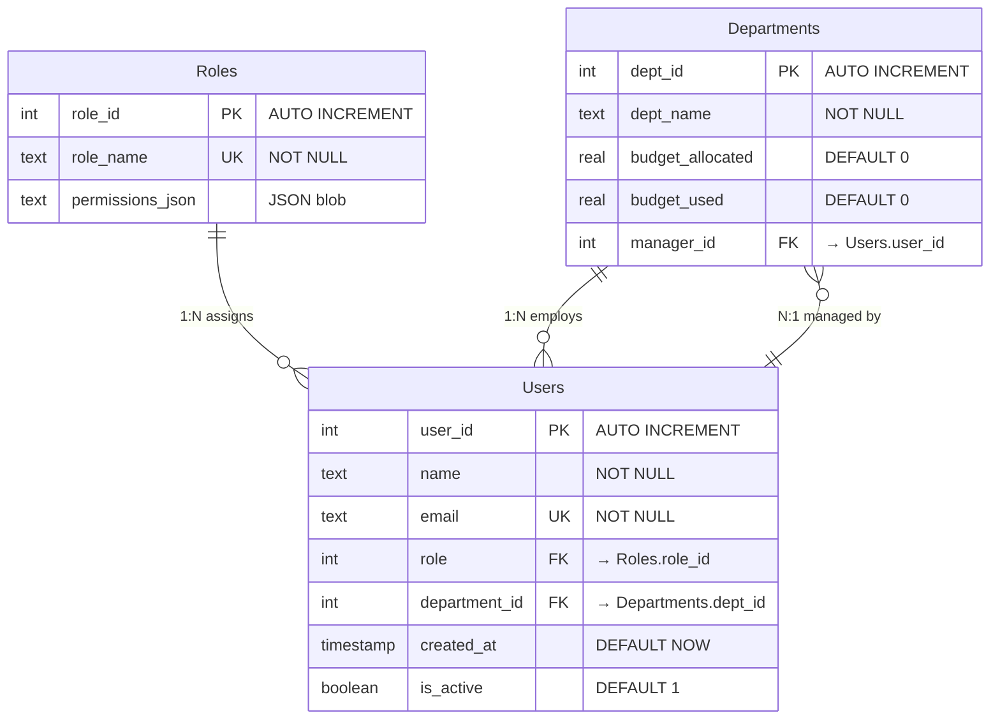

> **Cardinality:** One Role → Many Users (1:N). One Department → Many Users (1:N). One User manages zero or one Department (recursive FK).

---

### 📐 Crow's Foot ERD — Module 2: Purchase Request Workflow

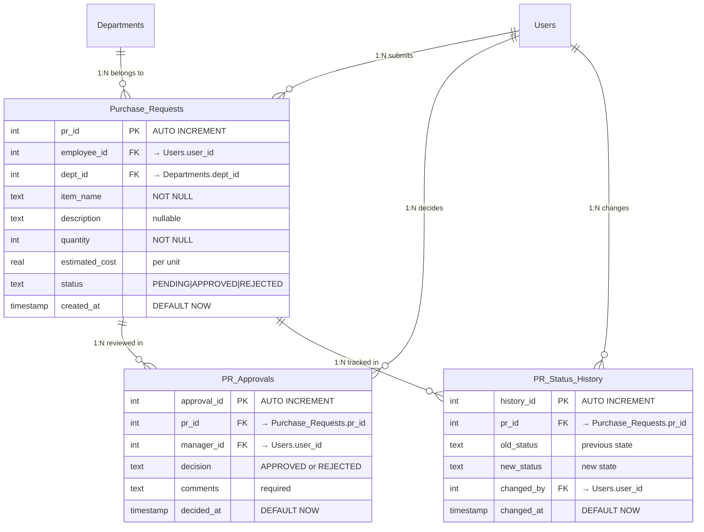

> **Cardinality:** One Purchase Request → Many Approvals (1:N, for re-reviews). One PR → Many Status History entries (1:N, full audit trail).

---

### 📐 Crow's Foot ERD — Module 3: Vendor Management

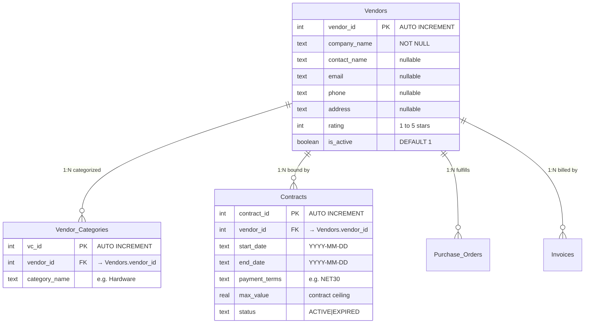

> **Cardinality:** One Vendor → Many Categories (1:N). One Vendor → Many Contracts (1:N). One Vendor → Many POs (1:N).

---

### 📐 Crow's Foot ERD — Module 4: Order Fulfillment & Finance

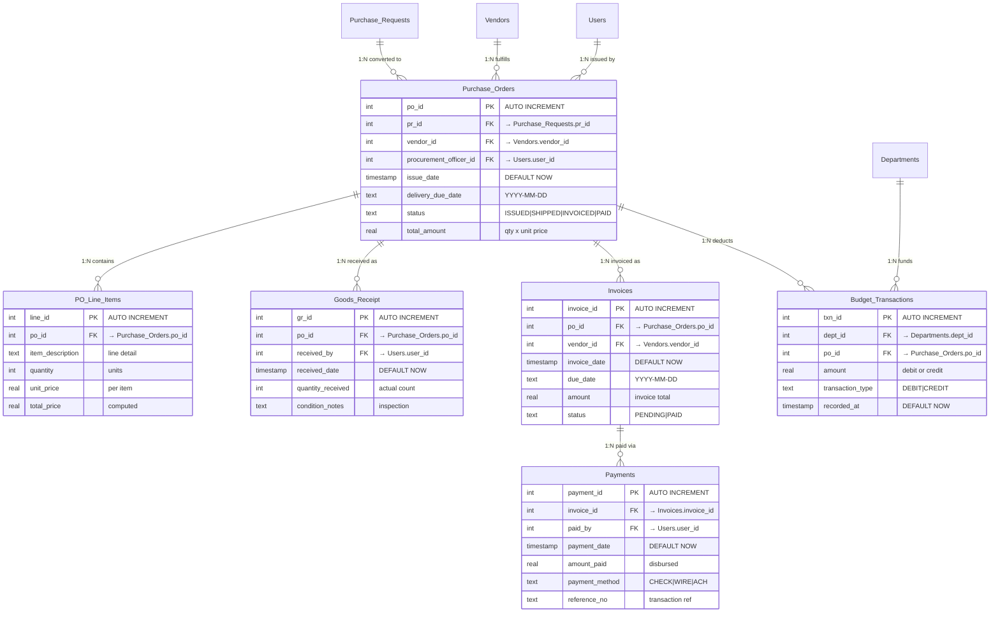

> **Cardinality:** One PO → Many Line Items (1:N). One PO → Many Goods Receipts (1:N). One Invoice → Many Payments (1:N, for partial payments).

---

### 📐 Crow's Foot ERD — Module 5: System Monitoring & Audit

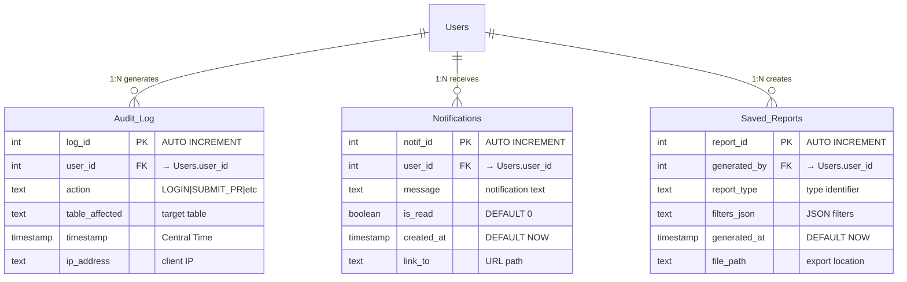

---

### 📝 Formal Relational Schema Notation

The following is the **textual relational schema** using standard database notation where **underlined** attributes are primary keys and *italicized* attributes are foreign keys:

```
Roles (role_id, role_name, permissions_json)

Departments (dept_id, dept_name, budget_allocated, budget_used, manager_id*)
    manager_id* → Users.user_id

Users (user_id, name, email, role*, department_id*, created_at, is_active)
    role* → Roles.role_id
    department_id* → Departments.dept_id

Purchase_Requests (pr_id, employee_id*, dept_id*, item_name, description,
                   quantity, estimated_cost, status, created_at)
    employee_id* → Users.user_id
    dept_id* → Departments.dept_id

PR_Approvals (approval_id, pr_id*, manager_id*, decision, comments, decided_at)
    pr_id* → Purchase_Requests.pr_id
    manager_id* → Users.user_id

PR_Status_History (history_id, pr_id*, old_status, new_status,
                   changed_by*, changed_at)
    pr_id* → Purchase_Requests.pr_id
    changed_by* → Users.user_id

Vendors (vendor_id, company_name, contact_name, email, phone, address,
         rating, is_active)

Vendor_Categories (vc_id, vendor_id*, category_name)
    vendor_id* → Vendors.vendor_id

Contracts (contract_id, vendor_id*, start_date, end_date, payment_terms,
           max_value, status)
    vendor_id* → Vendors.vendor_id

Purchase_Orders (po_id, pr_id*, vendor_id*, procurement_officer_id*,
                 issue_date, delivery_due_date, status, total_amount)
    pr_id* → Purchase_Requests.pr_id
    vendor_id* → Vendors.vendor_id
    procurement_officer_id* → Users.user_id

PO_Line_Items (line_id, po_id*, item_description, quantity,
               unit_price, total_price)
    po_id* → Purchase_Orders.po_id

Goods_Receipt (gr_id, po_id*, received_by*, received_date,
               quantity_received, condition_notes)
    po_id* → Purchase_Orders.po_id
    received_by* → Users.user_id

Invoices (invoice_id, po_id*, vendor_id*, invoice_date, due_date,
          amount, status)
    po_id* → Purchase_Orders.po_id
    vendor_id* → Vendors.vendor_id

Payments (payment_id, invoice_id*, paid_by*, payment_date,
          amount_paid, payment_method, reference_no)
    invoice_id* → Invoices.invoice_id
    paid_by* → Users.user_id

Budget_Transactions (txn_id, dept_id*, po_id*, amount,
                     transaction_type, recorded_at)
    dept_id* → Departments.dept_id
    po_id* → Purchase_Orders.po_id

Notifications (notif_id, user_id*, message, is_read, created_at, link_to)
    user_id* → Users.user_id

Saved_Reports (report_id, generated_by*, report_type, filters_json,
               generated_at, file_path)
    generated_by* → Users.user_id

Audit_Log (log_id, user_id*, action, table_affected, timestamp, ip_address)
    user_id* → Users.user_id
```

> **Legend:** `attribute` = column, `attribute*` = foreign key, first attribute in each relation = primary key. All PKs use `INTEGER PRIMARY KEY AUTOINCREMENT`.

---

### 📝 DDL — CREATE TABLE Statements (SQLite)

<details>
<summary><strong>Click to expand full SQL DDL for all 16 tables</strong></summary>

```sql
-- ============================================
-- MODULE 1: USER IDENTITY & ACCESS CONTROL
-- ============================================

CREATE TABLE Roles (
    role_id    INTEGER PRIMARY KEY AUTOINCREMENT,
    role_name  TEXT UNIQUE NOT NULL,
    permissions_json TEXT
);

CREATE TABLE Departments (
    dept_id          INTEGER PRIMARY KEY AUTOINCREMENT,
    dept_name        TEXT NOT NULL,
    budget_allocated REAL DEFAULT 0,
    budget_used      REAL DEFAULT 0,
    manager_id       INTEGER,
    FOREIGN KEY (manager_id) REFERENCES Users(user_id)
);

CREATE TABLE Users (
    user_id       INTEGER PRIMARY KEY AUTOINCREMENT,
    name          TEXT NOT NULL,
    email         TEXT UNIQUE NOT NULL,
    role          INTEGER,
    department_id INTEGER,
    created_at    TIMESTAMP DEFAULT CURRENT_TIMESTAMP,
    is_active     BOOLEAN DEFAULT 1,
    FOREIGN KEY (role) REFERENCES Roles(role_id),
    FOREIGN KEY (department_id) REFERENCES Departments(dept_id)
);

-- ============================================
-- MODULE 2: PURCHASE REQUEST WORKFLOW
-- ============================================

CREATE TABLE Purchase_Requests (
    pr_id          INTEGER PRIMARY KEY AUTOINCREMENT,
    employee_id    INTEGER,
    dept_id        INTEGER,
    item_name      TEXT NOT NULL,
    description    TEXT,
    quantity       INTEGER NOT NULL,
    estimated_cost REAL,
    status         TEXT DEFAULT 'PENDING',
    created_at     TIMESTAMP DEFAULT CURRENT_TIMESTAMP,
    FOREIGN KEY (employee_id) REFERENCES Users(user_id),
    FOREIGN KEY (dept_id) REFERENCES Departments(dept_id)
);

CREATE TABLE PR_Approvals (
    approval_id INTEGER PRIMARY KEY AUTOINCREMENT,
    pr_id       INTEGER,
    manager_id  INTEGER,
    decision    TEXT,
    comments    TEXT,
    decided_at  TIMESTAMP DEFAULT CURRENT_TIMESTAMP,
    FOREIGN KEY (pr_id) REFERENCES Purchase_Requests(pr_id),
    FOREIGN KEY (manager_id) REFERENCES Users(user_id)
);

CREATE TABLE PR_Status_History (
    history_id INTEGER PRIMARY KEY AUTOINCREMENT,
    pr_id      INTEGER,
    old_status TEXT,
    new_status TEXT,
    changed_by INTEGER,
    changed_at TIMESTAMP DEFAULT CURRENT_TIMESTAMP,
    FOREIGN KEY (pr_id) REFERENCES Purchase_Requests(pr_id),
    FOREIGN KEY (changed_by) REFERENCES Users(user_id)
);

-- ============================================
-- MODULE 3: VENDOR MANAGEMENT
-- ============================================

CREATE TABLE Vendors (
    vendor_id    INTEGER PRIMARY KEY AUTOINCREMENT,
    company_name TEXT NOT NULL,
    contact_name TEXT,
    email        TEXT,
    phone        TEXT,
    address      TEXT,
    rating       INTEGER,
    is_active    BOOLEAN DEFAULT 1
);

CREATE TABLE Vendor_Categories (
    vc_id         INTEGER PRIMARY KEY AUTOINCREMENT,
    vendor_id     INTEGER,
    category_name TEXT,
    FOREIGN KEY (vendor_id) REFERENCES Vendors(vendor_id)
);

CREATE TABLE Contracts (
    contract_id  INTEGER PRIMARY KEY AUTOINCREMENT,
    vendor_id    INTEGER,
    start_date   TEXT,
    end_date     TEXT,
    payment_terms TEXT,
    max_value    REAL,
    status       TEXT,
    FOREIGN KEY (vendor_id) REFERENCES Vendors(vendor_id)
);

-- ============================================
-- MODULE 4: ORDER FULFILLMENT
-- ============================================

CREATE TABLE Purchase_Orders (
    po_id                  INTEGER PRIMARY KEY AUTOINCREMENT,
    pr_id                  INTEGER,
    vendor_id              INTEGER,
    procurement_officer_id INTEGER,
    issue_date             TIMESTAMP DEFAULT CURRENT_TIMESTAMP,
    delivery_due_date      TEXT,
    status                 TEXT DEFAULT 'ISSUED',
    total_amount           REAL,
    FOREIGN KEY (pr_id) REFERENCES Purchase_Requests(pr_id),
    FOREIGN KEY (vendor_id) REFERENCES Vendors(vendor_id),
    FOREIGN KEY (procurement_officer_id) REFERENCES Users(user_id)
);

CREATE TABLE PO_Line_Items (
    line_id          INTEGER PRIMARY KEY AUTOINCREMENT,
    po_id            INTEGER,
    item_description TEXT,
    quantity         INTEGER,
    unit_price       REAL,
    total_price      REAL,
    FOREIGN KEY (po_id) REFERENCES Purchase_Orders(po_id)
);

CREATE TABLE Goods_Receipt (
    gr_id             INTEGER PRIMARY KEY AUTOINCREMENT,
    po_id             INTEGER,
    received_by       INTEGER,
    received_date     TIMESTAMP DEFAULT CURRENT_TIMESTAMP,
    quantity_received INTEGER,
    condition_notes   TEXT,
    FOREIGN KEY (po_id) REFERENCES Purchase_Orders(po_id),
    FOREIGN KEY (received_by) REFERENCES Users(user_id)
);

-- ============================================
-- MODULE 5: FINANCE & PAYMENTS
-- ============================================

CREATE TABLE Invoices (
    invoice_id   INTEGER PRIMARY KEY AUTOINCREMENT,
    po_id        INTEGER,
    vendor_id    INTEGER,
    invoice_date TIMESTAMP DEFAULT CURRENT_TIMESTAMP,
    due_date     TEXT,
    amount       REAL,
    status       TEXT DEFAULT 'PENDING',
    FOREIGN KEY (po_id) REFERENCES Purchase_Orders(po_id),
    FOREIGN KEY (vendor_id) REFERENCES Vendors(vendor_id)
);

CREATE TABLE Payments (
    payment_id     INTEGER PRIMARY KEY AUTOINCREMENT,
    invoice_id     INTEGER,
    paid_by        INTEGER,
    payment_date   TIMESTAMP DEFAULT CURRENT_TIMESTAMP,
    amount_paid    REAL,
    payment_method TEXT,
    reference_no   TEXT,
    FOREIGN KEY (invoice_id) REFERENCES Invoices(invoice_id),
    FOREIGN KEY (paid_by) REFERENCES Users(user_id)
);

CREATE TABLE Budget_Transactions (
    txn_id           INTEGER PRIMARY KEY AUTOINCREMENT,
    dept_id          INTEGER,
    po_id            INTEGER,
    amount           REAL,
    transaction_type TEXT,
    recorded_at      TIMESTAMP DEFAULT CURRENT_TIMESTAMP,
    FOREIGN KEY (dept_id) REFERENCES Departments(dept_id),
    FOREIGN KEY (po_id) REFERENCES Purchase_Orders(po_id)
);

-- ============================================
-- MODULE 6: SYSTEM & MONITORING
-- ============================================

CREATE TABLE Audit_Log (
    log_id         INTEGER PRIMARY KEY AUTOINCREMENT,
    user_id        INTEGER,
    action         TEXT,
    table_affected TEXT,
    timestamp      TIMESTAMP DEFAULT CURRENT_TIMESTAMP,
    ip_address     TEXT,
    FOREIGN KEY (user_id) REFERENCES Users(user_id)
);

CREATE TABLE Notifications (
    notif_id   INTEGER PRIMARY KEY AUTOINCREMENT,
    user_id    INTEGER,
    message    TEXT,
    is_read    BOOLEAN DEFAULT 0,
    created_at TIMESTAMP DEFAULT CURRENT_TIMESTAMP,
    link_to    TEXT,
    FOREIGN KEY (user_id) REFERENCES Users(user_id)
);

CREATE TABLE Saved_Reports (
    report_id    INTEGER PRIMARY KEY AUTOINCREMENT,
    generated_by INTEGER,
    report_type  TEXT,
    filters_json TEXT,
    generated_at TIMESTAMP DEFAULT CURRENT_TIMESTAMP,
    file_path    TEXT,
    FOREIGN KEY (generated_by) REFERENCES Users(user_id)
);
```

</details>

---

### 📊 Cardinality & Participation Summary

| Relationship | Type | Left Entity | Right Entity | Participation |
|-------------|------|-------------|--------------|---------------|
| Roles → Users | **1:N** | Roles (1, mandatory) | Users (N, mandatory) | Total both sides |
| Departments → Users | **1:N** | Departments (1) | Users (N) | Total-Partial |
| Users → Purchase_Requests | **1:N** | Users (1) | PRs (N, optional) | Total-Partial |
| Purchase_Requests → PR_Approvals | **1:N** | PRs (1) | Approvals (N) | Total-Partial |
| Purchase_Requests → PR_Status_History | **1:N** | PRs (1) | History (N) | Total-Partial |
| Purchase_Requests → Purchase_Orders | **1:1** | PRs (1) | POs (0..1) | Total-Partial |
| Vendors → Purchase_Orders | **1:N** | Vendors (1) | POs (N) | Total-Partial |
| Purchase_Orders → PO_Line_Items | **1:N** | POs (1) | Lines (N) | Total-Partial |
| Purchase_Orders → Goods_Receipt | **1:N** | POs (1) | GRs (N) | Total-Partial |
| Purchase_Orders → Invoices | **1:N** | POs (1) | Invoices (N) | Total-Partial |
| Invoices → Payments | **1:N** | Invoices (1) | Payments (N) | Total-Partial |
| Vendors → Vendor_Categories | **1:N** | Vendors (1) | Categories (N) | Total-Partial |
| Vendors → Contracts | **1:N** | Vendors (1) | Contracts (N) | Total-Partial |
| Users → Audit_Log | **1:N** | Users (1) | Logs (N) | Total-Partial |
| Departments → Budget_Transactions | **1:N** | Depts (1) | Txns (N) | Total-Partial |

---

## 👥 User Roles & Workflow

### Complete Procurement Lifecycle

```
Step 1          Step 2          Step 3           Step 4          Step 5           Step 6
┌─────────┐    ┌─────────┐    ┌────────────┐   ┌─────────┐    ┌─────────┐     ┌─────────┐
│EMPLOYEE │───▶│MANAGER  │───▶│PROCUREMENT │──▶│ VENDOR  │───▶│FINANCE  │────▶│  PAID   │
│ Submit  │    │ Approve │    │ Issue PO   │   │  Ship   │    │ Invoice │     │  ✅     │
│ Request │    │/Reject  │    │ + Vendor   │   │ Goods   │    │ Process │     │         │
└─────────┘    └─────────┘    └────────────┘   └─────────┘    └─────────┘     └─────────┘
```

### Role-by-Role Breakdown

#### 1. 👤 Employee
- **What they do:** Submit purchase requests for items they need
- **What they see:** A form to create requests + their complete request history
- **KPI Cards:** Total Requests | Approved Count | Pending Count
- **Visualization:** Doughnut chart showing approval vs. rejection ratio

#### 2. 👔 Manager
- **What they do:** Review and approve/reject purchase requests from their department
- **What they see:** Pending requests with approve/reject buttons, department budget status
- **KPI Cards:** Pending Approvals | Total Budget | Budget Used
- **Controls:** Must provide a review comment with every decision

#### 3. 📋 Procurement Officer
- **What they do:** Convert approved requests into official Purchase Orders by selecting a vendor
- **What they see:** Approved requests ready for PO generation + active PO pipeline
- **KPI Cards:** Requests To Issue | Active Pipeline | Total Pipeline Value
- **Controls:** Vendor selection dropdown with ratings, delivery date picker

#### 4. 🏭 Vendor
- **What they do:** View assigned purchase orders and mark them as shipped
- **What they see:** Their open orders with values and due dates
- **KPI Cards:** Total Orders | Pending Shipment | Contracted Value
- **Controls:** "Mark Shipped" button for each issued PO

#### 5. 💰 Finance
- **What they do:** Process invoices for shipped goods and track payments
- **What they see:** Pending goods receipts + accounts payable ledger
- **KPI Cards:** Ready for Invoice | Unpaid Invoices | Capital Paid Out
- **Controls:** "Process Invoice" button for each shipped receipt

#### 6. 🛡️ Super Admin
- **What they do:** Monitor the entire system — budgets, orders, audit trail
- **What they see:** Department budgets chart, PO pipeline chart, full audit log
- **KPI Cards:** Operating Departments | Total Issued POs | Recorded Audit Events
- **Controls:** Delete individual log entries or clear all logs at once
- **Charts:** Department Budget Doughnut + PO Status Pipeline Pie Chart

---

## 📊 KPI Dashboards

Every role's dashboard starts with **3 Key Performance Indicator (KPI) cards** — large, color-coded numbers that give instant insight without requiring any technical knowledge:

| Role | KPI 1 | KPI 2 | KPI 3 |
|------|-------|-------|-------|
| **Employee** | Total Requests (white) | Approved (green) | Pending (gray) |
| **Manager** | Pending Approvals (white) | Total Budget (green) | Budget Used (red) |
| **Procurement** | To Issue (blue) | Active Pipeline (green) | Pipeline Value (yellow) |
| **Vendor** | Total Orders (white) | Pending Shipment (yellow) | Contracted Value (green) |
| **Finance** | Ready for Invoice (blue) | Unpaid (yellow) | Capital Paid (green) |
| **Super Admin** | Departments (blue) | Total POs (blue) | Audit Events (gray) |

---

## 🖥 Installation & Setup

### Prerequisites
- Python 3.10 or higher
- pip (Python package manager)
- Git

### Local Development

```bash
# 1. Clone the repository
git clone https://github.com/nisarg-007/procurement_system.git
cd procurement_system

# 2. Create a virtual environment
python -m venv .venv

# 3. Activate it
# Windows:
.venv\Scripts\activate
# macOS/Linux:
source .venv/bin/activate

# 4. Install dependencies
pip install -r requirements.txt

# 5. Run the application
python app.py
```

The app will start at **http://127.0.0.1:5000**

> **Note:** The database (`procurement.db`) is pre-populated with test users, departments, vendors, and sample procurement data. If you need to reset it, delete the file and run `python setup_db.py` followed by `python populate_db.py`.

---

## ☁️ Deployment on Vercel

The application is deployed as a **serverless Python function** on Vercel:

1. **`vercel.json`** configures the build to use `@vercel/python` runtime
2. **All routes** (`/(.*)`) are forwarded to `app.py`
3. **Database handling:** Since Vercel's filesystem is read-only, the app copies `procurement.db` to `/tmp/` on first request
4. **CI/CD:** Every `git push` to the `master` branch triggers an automatic Vercel redeploy

### Environment Detection
```python
if os.environ.get('VERCEL') == '1':
    # Use /tmp/ for database operations
else:
    # Use local procurement.db directly
```

---

## 📁 Project Structure

```
procurement_system/
├── app.py                  # Main Flask application (routes, auth, logic)
├── setup_db.py             # Database schema creation & initial seed data
├── populate_db.py          # Dummy data generator (15+ realistic entries)
├── procurement.db          # SQLite database file (pre-populated)
├── requirements.txt        # Python dependencies
├── vercel.json             # Vercel deployment configuration
├── .gitignore              # Git exclusions
├── README.md               # This file
│
├── static/
│   └── style.css           # Custom CSS (dark theme, glassmorphism, animations)
│
└── templates/
    ├── base.html            # Base layout (navbar, background blobs, scripts)
    ├── login.html           # Firebase authentication login page
    └── dashboard.html       # Role-based dashboard (all 6 roles in one template)
```

---

## 🔑 Test Accounts

All accounts use the password: **`123456`**

| Email | Role | Access Level |
|-------|------|-------------|
| `employee@test.com` | Employee | Submit purchase requests |
| `manager@test.com` | Manager | Approve/reject requests, view budget |
| `procurement@test.com` | Procurement | Issue POs, manage vendor pipeline |
| `vendor@test.com` | Vendor | View orders, mark shipments |
| `finance@test.com` | Finance | Process invoices, track payments |
| `admin@test.com` | Super Admin | Full system oversight, log management |

---

## 🔒 Security Features

| Feature | Implementation |
|---------|---------------|
| **Authentication** | Firebase Auth SDK (client-side) + Flask-Login (server-side sessions) |
| **API Key Restrictions** | Firebase API keys restricted to `127.0.0.1:5000` and `*.vercel.app` domains |
| **Role-Based Access** | Each route checks `current_user.role_name` before serving data |
| **CSRF Protection** | Flask session-based with secret key |
| **Audit Logging** | Every login, logout, and data mutation is recorded with IP and timestamp |
| **Timezone Consistency** | All timestamps recorded in US/Central timezone via `pytz` |
| **Input Validation** | Server-side form validation on all POST routes |
| **Admin Controls** | Only SuperAdmin role can access log deletion endpoints |

---

## 🧪 Tools & Technologies Summary

```
Backend Framework ......... Flask 3.0.2 (Python)
Database .................. SQLite 3 (embedded, file-based)
Authentication ............ Firebase Auth (Email/Password)
Session Management ........ Flask-Login 0.6.3
Timezone Handling ......... pytz (US/Central)
Frontend Framework ........ Bootstrap 5.3.3
Charting Library .......... Chart.js 4.x
Template Engine ........... Jinja2 (bundled with Flask)
Typography ................ Google Fonts (Inter)
Deployment Platform ....... Vercel (serverless Python)
Version Control ........... Git + GitHub
CI/CD .................... Vercel GitHub Integration (auto-deploy on push)
Design Language ........... Dark theme, Glassmorphism, CSS animations
```

---

## 👨‍💻 Author

**Nisarg Shah**
- GitHub: [@nisarg-007](https://github.com/nisarg-007)
- Course: Database Management (DBMT) — Semester 2

---

> *Built as a comprehensive database management project demonstrating relational database design, normalized schema architecture, role-based access control, and full-stack web development.*
